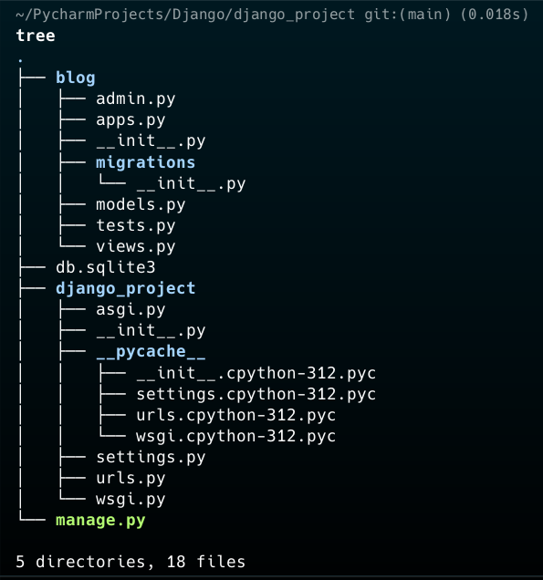

# Django Notes

## Flask VS Django

- Flask is a micro web framework for Python based on Werkzeug, Jinja 2 and good intentions.
- Django is a high-level Python web framework that encourages rapid development and clean, pragmatic design.

## Django File Structure

- `blog/admin.py`: Registers and manages the admin interface for the blog app.

- `blog/apps.py`: Configuration for the blog app within the project.

- `blog/__init__.py`: Marks the blog directory as a Python package.

- `blog/migrations/__init__.py`: Marks the migrations folder as a Python package; used for database migrations.

- `blog/models.py`: Defines the database schema and data structure for the blog app.

- `blog/tests.py`: Contains test cases for the blog app to ensure functionality.

- `blog/views.py`: Contains logic to handle HTTP requests and responses for the blog app.

- `db.sqlite3`: SQLite database file storing the project's data.

- `django_project/asgi.py`: Configures the ASGI application for handling asynchronous web requests.

- `django_project/__init__.py`: Marks the django_project directory as a Python package.

- `django_project/settings.py`: Contains configuration settings for the Django project.

- `django_project/urls.py`: Maps URLs to their respective views in the project.

- `django_project/wsgi.py`: Configures the WSGI application for serving the project in production.

- `manage.py`: A command-line utility for managing the Django project (e.g., running the server, migrations).

---
## include() function
- include() function allows referencing other URL configurations.
- include function cuts off the URL which is already processed and sends the remaining string to the included URLconf for further processing.
- When we go to `localhost/blog/` it will cut off the `blog/` part and send the remaining string to the blog app's URLconf for further processing.
- When er go to `localhost/about/` it will cut off the `about/` part and send the remaining string to the about app's URLconf for further processing.

---
## Database Migration

Database migration in Django synchronizes the database schema with changes in the `models.py` file, ensuring consistency between the code and database.

### Key Commands
- `python3 manage.py makemigrations`: Generates migration files for model changes.
- `python3 manage.py migrate`: Applies migration files to the database.
- `python3 manage.py sqlmigrate <app_name> <migration_number>`: Displays the SQL code for a specific migration.

### Example Workflow
1. Define or update a model in `models.py`.
2. Run `makemigrations` to create migration files.
3. Run `migrate` to apply changes to the database.

### Benefits
- Tracks schema changes.
- Ensures consistency between code and database.
- Simplifies schema updates without manual SQL.
---

## Django ORM

Django ORM (Object-Relational Mapping) is a tool that allows developers to interact with databases using Python code instead of raw SQL. It enables creating, retrieving, updating, and deleting database records as Python objects, simplifying database operations and ensuring compatibility across different database systems.

---
## CSRF Token
Django uses CSRF (Cross-Site Request Forgery) tokens to protect against malicious attacks. CSRF tokens are unique, random values generated for each user session and included in forms to verify the authenticity of requests. When a user submits a form, Django checks the CSRF token to ensure that the request originated from the correct site and not from a malicious source.

---
## Django Messages
Django messages framework allows developers to display messages to users based on their actions or system events. Messages can be used to provide feedback, alerts, or notifications to users, enhancing the user experience and improving communication between the application and users.

- `messages.debug(request, message)`: Displays a debug-level message.
- `messages.info(request, message)`: Displays an informational message.
- `messages.success(request, message)`: Displays a success message.
- `messages.warning(request, message)`: Displays a warning message.
- `messages.error(request, message)`: Displays an error message.

---